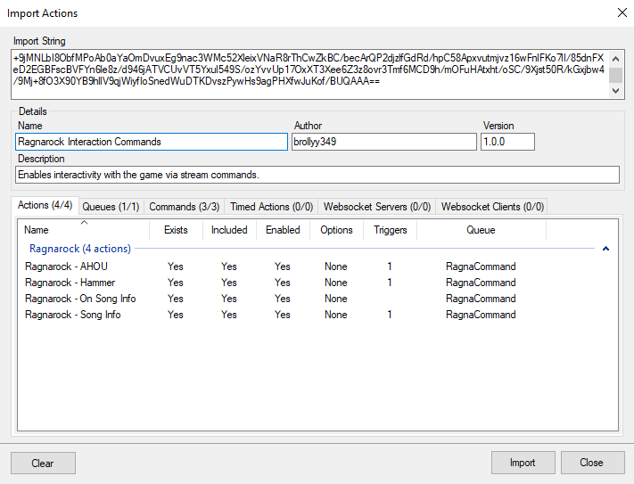
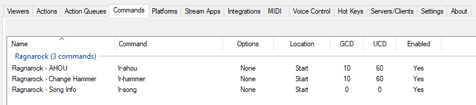

# Commands for interacting the the game

These commands allow chat to interact with the game while the song is playing. Alternatively, the actions that are called by these commands can be used with Channel Points redemption.

## Commands

1. Ragnarock - AHOU:`!r-ahou {left|right|first|second|third|fourth}`

    Triggers the same cherring animation in-game as when the shields are hit.
    
    Without the optional parameter (just `!r-ahou`) - all vikings will cheer, or you can specify which column/row should cheer with the parameter.

    Example: `!r-ahou left` - all four vikings on the left will cheer.

    **Note**: This is animation only. If you want to have the sound as well, you'll need to add a separate sub-action to `Ragnarock - AHOU` action to play a sound file.

2. Ragnarock - Hammer: `!r-hammer {hammerNameOrId} {left|right|both}`

    Changes the hammer for selected hand until the song ends or the hammer is changed again.

    When used without parameters (just `!r-hammer`), an explanation is displayed on how to use it (list of hammers is NOT displayed, as it's way too long). Without the second parameter, both hammers will be changed.

    Unknown hammer names, ids, or hammers you haven't unlocked yet will change your hammer to the original hammer skin (the one everyone starts with, not the one you started the song with).

    Examples:

    1. `!r-hammer Odin left` - changes left hand hammer to the Odin hammer
    2. `!r-hammer 16` - changes both hammers to Chicken Drumsticks

    List of supported hammers and their ids can be found [here](https://github.com/Brollyy/RagnarockWebsocketUtil/blob/master/src/RagnarockWebsocketCore/Enums/Hammer.cs).

3. Ragnarock - Song Info: `!r-song`

    Triggers a bot response in chat with the title and artist of the currently playing song.

## Installation

1. Import `RagnarockInteractionCommands.bot` into Streamer.bot to add the actions and commands.

2. Go to Commands tab and enable the commands you want to use (you can also adjust things like cooldowns or permissions if you want).
