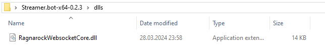
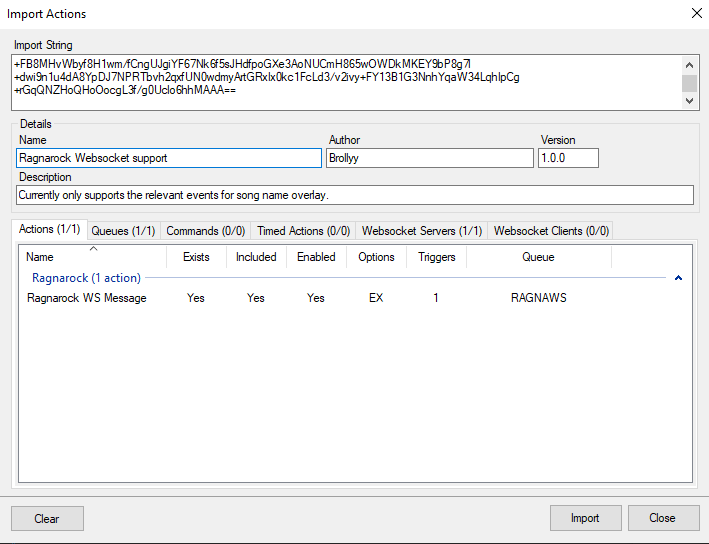

# Ragnarock Streamer.bot integration
Helpful Streamer.bot actions and commands for streaming [Ragnarock](https://www.ragnarock-game.com/home).

* Websocket capabilities are supported up to Jonathan Young RAID.
* Intended to be used with [Streamer.bot](https://streamer.bot/) 0.2.3 or later on Windows platform.

## Prerequisites

Before any of the features can be used, some prerequisite steps need to be done.

1. Copy the contents of `dlls` folder from this repository into the `dlls` folder in your Streamer.bot folder.

2. Open `%LocalAppData%\Ragnarock\Saved\Config\WindowsNoEditor\Game.ini` and make sure these lines are in there:
    ```ini
    CustomSocketURL="ws://{localIPv4}:8033/"
    CustomSocketIsEnabled=True
    ```
    Remember to replace `{localIPv4}` with your local IP address - this can be checked by e.g. running `ipconfig` in the command line.
    ```c
    C:\Users\***>ipconfig

    Windows IP Configuration

    ...

    Wireless LAN adapter Wi-Fi:

        Connection-specific DNS Suffix  . :
        Link-local IPv6 Address . . . . . : ***
        IPv4 Address. . . . . . . . . . . : 192.168.18.3
        Subnet Mask . . . . . . . . . . . : ***
        Default Gateway . . . . . . . . . : ***
    ```
    In this case the relevant lines in `Game.ini` would look like this:
    ```ini
    CustomSocketURL="ws://192.168.18.3:8033/"
    CustomSocketIsEnabled=True
    ```

    **WARNING**: if your local network uses DHCP, this address may periodically change, requiring update to `Game.ini`. Assign a static IP address to your PC if possible to avoid that.
3. Import `RagnarockWebsocketCore.bot` into Streamer.bot to enable a custom Websocket server communication with the game.
    

## Features

Each feature in this repository is a standalone group of actions/commands for a specific streamer need.
Specific installation steps for each are in README files specific to each feaure, which you can also access via the links below:

1. [Overlay for displaying current song name and artist](SongNameOverlay/README.md)
2. [Interaction commands - TODO](/README.md)
3. [Overlay for displaying perfects / accuracy - TODO](/README.md)

## Contact

If you have any issues / questions, open a new issue or DM me on Discord - @brollyy.