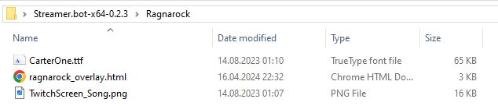
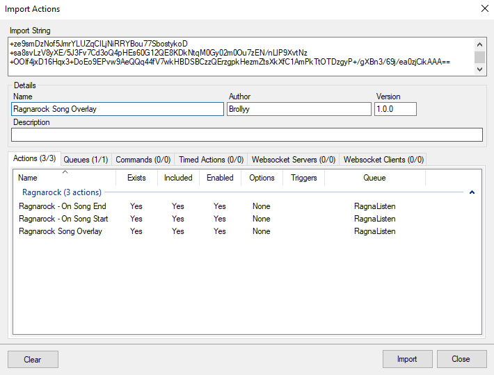
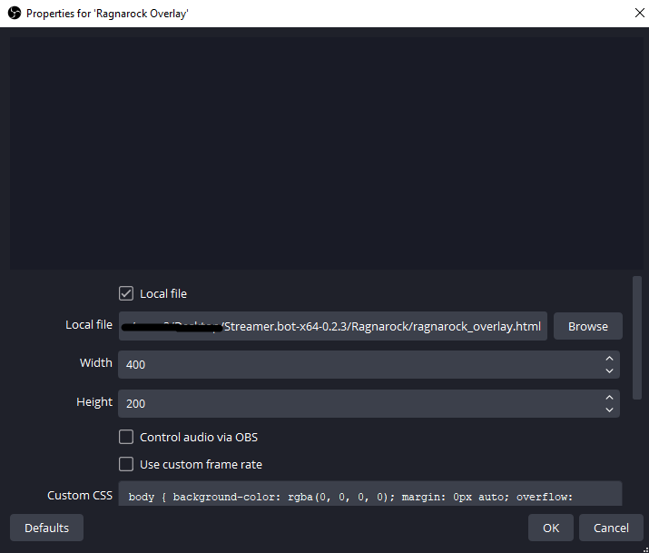

# Overlay for displaying current song name and artist

This overlay supports horizontal scrolling for long song names. It's setup to automatically refresh every 10 seconds, so it might take a few seconds after starting/finishing song for it to appear.


## Installation

1. Copy the contents of `SongNameOverlay/resources` folder from this repository into the `Ragnarock` folder in your Streamer.bot folder (create it if it doesn't exist there).
    
    
2. Import `RagnarockSongNameOverlay.bot` into Streamer.bot to add the actions necessary to update the overlay.

3. In OBS, create a new Browser source for the `Ragnarock/ragnarock_overlay.html` local file in your Streamer.bot installation folder, with `400` width, `200` height. You can set it to refresh browser when scene becomes active as well.


## Known issues

If the `Ragnarock/ragnarock_overlay.html` file is not updating, but the actions are triggered, you might need to change the path to the file inside of the C# code of the action `RagnarockSongOverlay` in the line 110:
```
File.WriteAllText("Ragnarock/ragnarock_overlay.html", sb.ToString());
```
Instead of `Ragnarock/ragnarock_overlay.html`, enter the full path to the file in there and click Save and Compile.